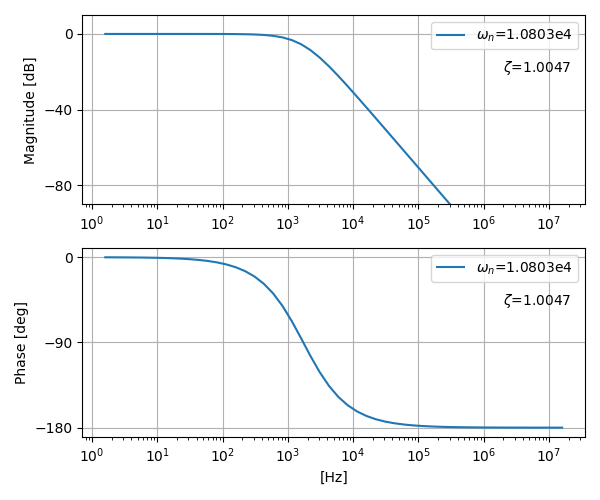

# Bode Plotter
(English version is [here](README.md))


このリポジトリには、Pythonとcontrolライブラリを使用してオープンループの2次ボード線図を生成するコードが含まれています。

## Installation

このコードを使用するには、以下の手順に従ってください：

1. リポジトリをローカルマシンにクローンします。
   ```
   git clone https://github.com/Davinci-Meg/bodePlotter.git
   cd bodePlotter
   ```
3. 必要な依存関係をインストールするために、以下のコマンドを実行します：
    ```
    pip install control matplotlib numpy
    ```
4. Python インタプリタを使用してコードを実行します。

## Usage

ボード線図を生成するには、単に `src/openloop-2ndOrder_bodePlot.py` スクリプトを実行します。生成されたボード線図は `img/openloop-2ndOrder_bodePlot.png` として保存されます。
生成されたデータを知りたい場合は、単に `src/openloop-2ndOrder_bodePlot_savedata.py` スクリプトを実行してください。生成されたプロットは `src/ax1_data.csv` および `src/ax2_data.csv` として保存されます。


## Example

生成された画像の例を表示します。



## Note

- このmdファイルは[README.md](README.md)をGPT-3.5によって日本語訳したものです。
- 画像の生成に関しては一切の責任を負いません。自己責任で進めてください。

## License

このプロジェクトは MIT ライセンスのもとで提供されています。詳細については [LICENSE](LICENSE) ファイルを参照してください。
